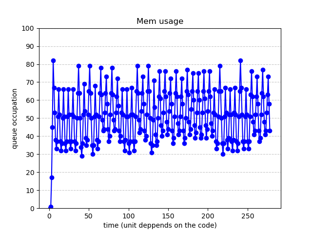

# 4˚ project for CRTP 2023/24

## project requirements
Producer-(single) consumer program with dynamic message rate adjustment. The consumer
shall consume messages at a given rate, that is, with a given delay simulating the consumed
message usage. An actor (task or process) separate from producer and consumer shall
periodically check the message queue length and if the length is below a given threshold, it
will increase the production rate. Otherwise (i.e. the message length is above the given
threshold), it will decrease the production rate.

## how to execute

Use the make command for running the makefile

run the program until you want to see the execution
use the python code `plotProject.py` for showing a plot of the memory usage of the program

